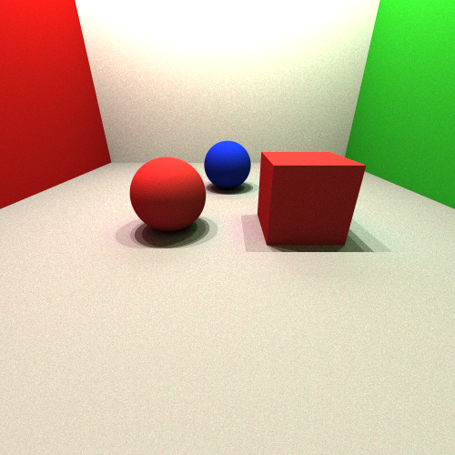

## Simple Ray Tracing

As the title suggests, this is a very simple ray tracer. It is written in C++ and uses the [OpenGL Mathematics](http://glm.g-truc.net/) library. I relied on the [Ray Tracing in One Weekend](https://raytracing.github.io/books/RayTracingInOneWeekend.html) book to write it, but using my own coding style.

